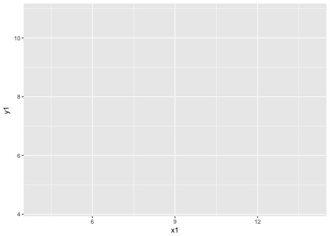
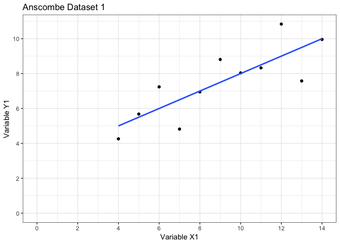
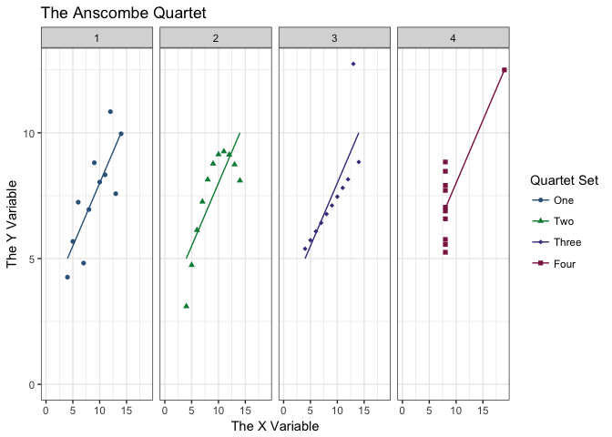
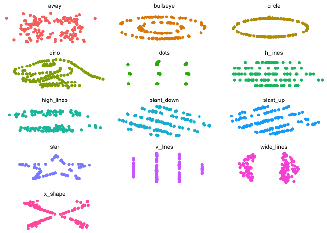

##About This Exercise
**Exercise Type:** Confidence Builder

*Confidence Builders are designed to get you more comfortable with R. We'll go through bits of code more or less step-by-step, and describe the reasoning behind certain actions. Remember - it's not cheating to copy code from this document and paste it into your R Studio console!*

**Exercise Suitability:** Beginner

*If you have R Studio installed on your machine and you know what an object is, you can work through this material.*

#The Anscombe Exercise
This exercise will take you through a really fun little dataset called the *Anscombe Quartet*. I've been trying to teach this exercise using data I've made up myself, and it's never quite worked. Imagine my delight when I heard that Francis Anscombe had already created the perfect dataset for me! At least, according to Wikipedia, no one knows exactly how he came up with it.

The **aim** of this exercise is to make you more comfortable with entering code in R. 

##Learning Outcomes
By the end of this workshop you should be able to . . .

* Provide descriptive statistics for data
* Run a simple regression on data
* Change arguments in a function
* Create visualisations in R


#The R Environment
Here are the packages you'll need for this exercise. (Remember, if you don't have one of these packages you can install it with the command: `install.packages(packagename)`

```r
library(ggplot2)
library(gridExtra)
library(pastecs)
```

```
## Loading required package: boot
```

```r
library(tidyr)
```

```
## 
## Attaching package: 'tidyr'
```

```
## The following object is masked from 'package:pastecs':
## 
##     extract
```

```r
library(dplyr)
```

```
## 
## Attaching package: 'dplyr'
```

```
## The following objects are masked from 'package:pastecs':
## 
##     first, last
```

```
## The following object is masked from 'package:gridExtra':
## 
##     combine
```

```
## The following objects are masked from 'package:stats':
## 
##     filter, lag
```

```
## The following objects are masked from 'package:base':
## 
##     intersect, setdiff, setequal, union
```


#The Anscombe Dataset
The Anscombe dataset is really interesting and comes pre-loaded as part of the package `datasets`. This is a package which comes as standard in any R installation and so we can look at it immediately just by typing the name of the dataset into R Studio. 

R Studio will show us all rows of this dataset because it's quite small (only 11 rows). If we had a larger dataset, it would cut off after about 10 rows.


```r
anscombe 
```

```
##    x1 x2 x3 x4    y1   y2    y3    y4
## 1  10 10 10  8  8.04 9.14  7.46  6.58
## 2   8  8  8  8  6.95 8.14  6.77  5.76
## 3  13 13 13  8  7.58 8.74 12.74  7.71
## 4   9  9  9  8  8.81 8.77  7.11  8.84
## 5  11 11 11  8  8.33 9.26  7.81  8.47
## 6  14 14 14  8  9.96 8.10  8.84  7.04
## 7   6  6  6  8  7.24 6.13  6.08  5.25
## 8   4  4  4 19  4.26 3.10  5.39 12.50
## 9  12 12 12  8 10.84 9.13  8.15  5.56
## 10  7  7  7  8  4.82 7.26  6.42  7.91
## 11  5  5  5  8  5.68 4.74  5.73  6.89
```


#Running Descriptive Statistics
Let's start by exploring the means and medians of all these variables. There is a very handy command `stat.desc` from the package`pastecs` which can do this for us. 

(Note - there are LOADS of packages which give you descriptive stats. Check out [this statmethods page](https://www.statmethods.net/stats/descriptives.html) for more examples. I just personally like `pastecs`.)


```r
stat.desc(anscombe)
```

```
##                      x1         x2         x3         x4         y1
## nbr.val      11.0000000 11.0000000 11.0000000 11.0000000 11.0000000
## nbr.null      0.0000000  0.0000000  0.0000000  0.0000000  0.0000000
## nbr.na        0.0000000  0.0000000  0.0000000  0.0000000  0.0000000
## min           4.0000000  4.0000000  4.0000000  8.0000000  4.2600000
## max          14.0000000 14.0000000 14.0000000 19.0000000 10.8400000
## range        10.0000000 10.0000000 10.0000000 11.0000000  6.5800000
## sum          99.0000000 99.0000000 99.0000000 99.0000000 82.5100000
## median        9.0000000  9.0000000  9.0000000  8.0000000  7.5800000
## mean          9.0000000  9.0000000  9.0000000  9.0000000  7.5009091
## SE.mean       1.0000000  1.0000000  1.0000000  1.0000000  0.6125408
## CI.mean.0.95  2.2281389  2.2281389  2.2281389  2.2281389  1.3648260
## var          11.0000000 11.0000000 11.0000000 11.0000000  4.1272691
## std.dev       3.3166248  3.3166248  3.3166248  3.3166248  2.0315681
## coef.var      0.3685139  0.3685139  0.3685139  0.3685139  0.2708429
##                      y2         y3         y4
## nbr.val      11.0000000 11.0000000 11.0000000
## nbr.null      0.0000000  0.0000000  0.0000000
## nbr.na        0.0000000  0.0000000  0.0000000
## min           3.1000000  5.3900000  5.2500000
## max           9.2600000 12.7400000 12.5000000
## range         6.1600000  7.3500000  7.2500000
## sum          82.5100000 82.5000000 82.5100000
## median        8.1400000  7.1100000  7.0400000
## mean          7.5009091  7.5000000  7.5009091
## SE.mean       0.6125676  0.6121958  0.6122425
## CI.mean.0.95  1.3648856  1.3640571  1.3641612
## var           4.1276291  4.1226200  4.1232491
## std.dev       2.0316567  2.0304236  2.0305785
## coef.var      0.2708547  0.2707231  0.2707110
```

For each variable in the array, `stat.desc` gives us:

* `nbr.val` Number of values within the variable
* `nbr.null` Number of null values
* `nbr.na` Number of missing values
* `min` Minimum value
* `max` Maximum value
* `range` Maximum-minimum value
* `sum` Sum of all non-missing values
* `median` The median value
* `mean` The mean value
* `SE.mean` The standard error of the mean
* `CI.mean.0.95` The 95% confidence intervals of this mean
* `var` The variance of this variable
* `std.dev` The standard deviation of the mean
* `coef.var` The variation coefficient (standard deviation/mean)

With these descriptive statistics, we might want to start writing our interpretation of the data. For example ...

> The average score of *x* was 9 ±3.3 standard deviations.

###Changing Arguments in a Function

You might decide you don't want to bother with *all* the elements of `stat.desc` and so you could explore how to modify the command by asking R `help("stat.desc")` which will show you the help documentation for the function. Note that it talks about *arguments*. 


```r
stat.desc(anscombe, basic=FALSE, norm=FALSE, p=0.99)
```

```
##                      x1         x2         x3         x4        y1
## median        9.0000000  9.0000000  9.0000000  8.0000000 7.5800000
## mean          9.0000000  9.0000000  9.0000000  9.0000000 7.5009091
## SE.mean       1.0000000  1.0000000  1.0000000  1.0000000 0.6125408
## CI.mean.0.99  3.1692727  3.1692727  3.1692727  3.1692727 1.9413089
## var          11.0000000 11.0000000 11.0000000 11.0000000 4.1272691
## std.dev       3.3166248  3.3166248  3.3166248  3.3166248 2.0315681
## coef.var      0.3685139  0.3685139  0.3685139  0.3685139 0.2708429
##                     y2        y3        y4
## median       8.1400000 7.1100000 7.0400000
## mean         7.5009091 7.5000000 7.5009091
## SE.mean      0.6125676 0.6121958 0.6122425
## CI.mean.0.99 1.9413936 1.9402153 1.9403633
## var          4.1276291 4.1226200 4.1232491
## std.dev      2.0316567 2.0304236 2.0305785
## coef.var     0.2708547 0.2707231 0.2707110
```

By setting the arguments `basic=FALSE` and `norm=FALSE`, we've told R we only care about the information that the `desc` argument gives us. Note, because we only want the `desc` argument we don't need to bother typing it in. It's set to `true` by default. You'd get the same result by typing `stat.desc(anscombe, basic=FALSE, desc=TRUE, norm=FALSE, p=0.99)` which you can try yourself. We've also changes the significance level of the confidence intervals to a p level of 0.99. 

In this example, there's no real harm in getting all the information `stat.desc` can give us, but when we start plotting the data we will want to play about with the arguments in the `ggplot` command, so that's why you're seeing them here!

#Run a Regression
We're going to run four regressions for this dataset (all four *x*s against all 4 *y*s) and explore them. This will be done using R's inbuilt stats package, so there's no need to load any specific package into our library. 


```r
regression1 <- lm (y1~x1, data=anscombe)
regression2 <- lm (y2~x2, data=anscombe)
regression3 <- lm (y3~x3, data=anscombe)
regression4 <- lm (y4~x4, data=anscombe)
summary (regression1)
```

```
## 
## Call:
## lm(formula = y1 ~ x1, data = anscombe)
## 
## Residuals:
##      Min       1Q   Median       3Q      Max 
## -1.92127 -0.45577 -0.04136  0.70941  1.83882 
## 
## Coefficients:
##             Estimate Std. Error t value Pr(>|t|)   
## (Intercept)   3.0001     1.1247   2.667  0.02573 * 
## x1            0.5001     0.1179   4.241  0.00217 **
## ---
## Signif. codes:  0 '***' 0.001 '**' 0.01 '*' 0.05 '.' 0.1 ' ' 1
## 
## Residual standard error: 1.237 on 9 degrees of freedom
## Multiple R-squared:  0.6665,	Adjusted R-squared:  0.6295 
## F-statistic: 17.99 on 1 and 9 DF,  p-value: 0.00217
```

```r
summary (regression2)
```

```
## 
## Call:
## lm(formula = y2 ~ x2, data = anscombe)
## 
## Residuals:
##     Min      1Q  Median      3Q     Max 
## -1.9009 -0.7609  0.1291  0.9491  1.2691 
## 
## Coefficients:
##             Estimate Std. Error t value Pr(>|t|)   
## (Intercept)    3.001      1.125   2.667  0.02576 * 
## x2             0.500      0.118   4.239  0.00218 **
## ---
## Signif. codes:  0 '***' 0.001 '**' 0.01 '*' 0.05 '.' 0.1 ' ' 1
## 
## Residual standard error: 1.237 on 9 degrees of freedom
## Multiple R-squared:  0.6662,	Adjusted R-squared:  0.6292 
## F-statistic: 17.97 on 1 and 9 DF,  p-value: 0.002179
```

```r
summary (regression3)
```

```
## 
## Call:
## lm(formula = y3 ~ x3, data = anscombe)
## 
## Residuals:
##     Min      1Q  Median      3Q     Max 
## -1.1586 -0.6146 -0.2303  0.1540  3.2411 
## 
## Coefficients:
##             Estimate Std. Error t value Pr(>|t|)   
## (Intercept)   3.0025     1.1245   2.670  0.02562 * 
## x3            0.4997     0.1179   4.239  0.00218 **
## ---
## Signif. codes:  0 '***' 0.001 '**' 0.01 '*' 0.05 '.' 0.1 ' ' 1
## 
## Residual standard error: 1.236 on 9 degrees of freedom
## Multiple R-squared:  0.6663,	Adjusted R-squared:  0.6292 
## F-statistic: 17.97 on 1 and 9 DF,  p-value: 0.002176
```

```r
summary (regression4)
```

```
## 
## Call:
## lm(formula = y4 ~ x4, data = anscombe)
## 
## Residuals:
##    Min     1Q Median     3Q    Max 
## -1.751 -0.831  0.000  0.809  1.839 
## 
## Coefficients:
##             Estimate Std. Error t value Pr(>|t|)   
## (Intercept)   3.0017     1.1239   2.671  0.02559 * 
## x4            0.4999     0.1178   4.243  0.00216 **
## ---
## Signif. codes:  0 '***' 0.001 '**' 0.01 '*' 0.05 '.' 0.1 ' ' 1
## 
## Residual standard error: 1.236 on 9 degrees of freedom
## Multiple R-squared:  0.6667,	Adjusted R-squared:  0.6297 
## F-statistic:    18 on 1 and 9 DF,  p-value: 0.002165
```

Here we might want to report these findings. 

> There was a significant, positive relationship between *x* and *y* (F^1,9^=18, p=0.002) in which *x* explained approximately 63% of the variation observed in *y*.

Now you're probably thinking "Great! Let's write up the paper and go home!"

#Visualising Data
Everything we've seen so far has shown us that we have identical relationships between *x* and *y* in the Anscombe dataset. So here's what we should have done first . . . 

We're going to use `ggplot` for this. (We're also going to lean very heavily on [Ian and Stella's great ggplot tutorial](https://ianhandel.github.io/plotting-with-r/index.html) which I recommend if you want to learn more about `ggplot`). We'll walk through building the first chart and then build the others in one go. 

##Understanding ggplot layers


```r
ggplot (data=anscombe, aes(x=x1, y=y1))
```

<!-- -->

The `ggplot` command first needs to know what *data* to use, (the `data` argument) and then what *aesthetics* ( the `aes` argument). But you will have spotted pretty quickly that there's no data in there yet! We need to start layering information into the `ggplot` command. The two most important types of layers are the geometric elements (`geoms`) and statistical transformations (`stats`). 

We'll begin by adding a layer of points with the `geom_point` function.


```r
ggplot (data=anscombe, aes(x=x1, y=y1)) + geom_point()
```

<!-- -->

Now we're getting somewhere! Let's add a statistical layer. 


```r
ggplot (data=anscombe, aes(x=x1, y=y1)) + geom_point() + stat_smooth (method="lm", se=FALSE)
```

<!-- -->

This looks like a proper chart! Still, your research methods teacher will probably shout at you if you don't have the x and y axis start at zero . . . 


```r
ggplot (data=anscombe, aes(x=x1, y=y1)) + geom_point() + stat_smooth(method="lm", se=FALSE) + expand_limits(x=0, y=0)
```

<!-- -->

And she'll also shout at you for not having the x and y axis share sensible scales 


```r
ggplot (data=anscombe, aes(x=x1, y=y1)) + geom_point() + stat_smooth(method="lm", se=FALSE) + expand_limits(x=0, y=0) + scale_x_continuous(breaks = seq(0, 20, 2)) + scale_y_continuous(breaks = seq(0, 10, 2))
```

<!-- -->

And why is the background grey? You know that's a waste of ink if you print it out. 


```r
ggplot(data=anscombe, aes(x=x1, y=y1)) + geom_point() + stat_smooth(method="lm", se=FALSE) + theme_bw() + expand_limits(x=0, y=0) + scale_x_continuous(breaks = seq(0, 20, 2)) + scale_y_continuous(breaks = seq(0, 10, 2))
```

<!-- -->

Maybe you need a title, and better axis labels too?


```r
ggplot(data=anscombe, aes(x=x1, y=y1)) + geom_point() + stat_smooth(method="lm",se=FALSE) + theme_bw() + expand_limits(x=0, y=0) + scale_x_continuous(breaks = seq(0, 20, 2)) + scale_y_continuous(breaks = seq(0, 10, 2)) + ggtitle("Anscombe Dataset 1") + xlab("Variable X1") + ylab("Variable Y1")
```

<!-- -->

##Building ggplots
Personally, I like to make my ggplots objects like so . . . 

```r
Anscombe1 <- ggplot(data=anscombe, aes(x=x1, y=y1)) + geom_point() + stat_smooth(method="lm",se=FALSE) + theme_bw() + expand_limits(x=0, y=0) + scale_x_continuous(breaks = seq(0, 20, 2)) + scale_y_continuous(breaks = seq(0, 10, 2)) + ggtitle("Anscombe Dataset 1") + xlab("Variable X1") + ylab("Variable Y1")
```

Then I can call them back much more easily if I want to look at them again


```r
Anscombe1
```

<!-- -->

And now I can combine these into a grid. 

```r
Anscombe2 <- ggplot(data=anscombe, aes(x=x2, y=y2)) + geom_point() + stat_smooth(method="lm", se=FALSE) + theme_bw() + expand_limits(x=0, y=0) + scale_x_continuous(breaks = seq(0, 20, 2)) + scale_y_continuous(breaks = seq(0, 10, 2)) + ggtitle("Anscombe Dataset 2") + xlab("Variable X2") + ylab("Variable Y2")
Anscombe3 <- ggplot(data=anscombe, aes(x=x3, y=y3)) + geom_point() + stat_smooth(method="lm", se=FALSE) + theme_bw() + expand_limits(x=0, y=0) + scale_x_continuous(breaks = seq(0, 20, 2)) + scale_y_continuous(breaks = seq(0, 10, 2)) + ggtitle("Anscombe Dataset 3") + xlab("Variable X3") + ylab("Variable Y3")
Anscombe4 <- ggplot(data=anscombe, aes(x=x4, y=y4)) + geom_point() + stat_smooth(method="lm", se=FALSE) + theme_bw() + expand_limits(x=0, y=0) + scale_x_continuous(breaks = seq(0, 20, 2)) + scale_y_continuous(breaks = seq(0, 10, 2)) + ggtitle("Anscombe Dataset 4") + xlab("Variable X4") + ylab("Variable Y4")

#And now let's put them all together!

grid.arrange(Anscombe1, Anscombe2, Anscombe3, Anscombe4, top="This is why you always visualise data first!")
```

<!-- -->


Lesson learned, eh?!

#Where Do We Go From Here?
If you spend enough time on it, you can create truly beautiful visualisations in `ggplot2`. Play about with this code and see what you can do with it - share your best attempts! 


I want to create a chart with all the sets overlaid, so I need all the x values in one column, all the y columns in another, and a new factor to tell me which set it belonged to. To change the shape of the data I'm going to use the `tidyr` and `dplyr` packages to do this. 


```r
LongAnscombe <- anscombe %>%
  mutate(observation=seq_len(n()))%>%
  gather(key, value, -observation)%>% 
  separate(key, c("variable", "set") , 1 , convert=TRUE)%>%
  mutate(set=c("1", "2", "3", "4")[set])%>%
  spread(variable, value)
LongAnscombe
```

```
##    observation set  x     y
## 1            1   1 10  8.04
## 2            1   2 10  9.14
## 3            1   3 10  7.46
## 4            1   4  8  6.58
## 5            2   1  8  6.95
## 6            2   2  8  8.14
## 7            2   3  8  6.77
## 8            2   4  8  5.76
## 9            3   1 13  7.58
## 10           3   2 13  8.74
## 11           3   3 13 12.74
## 12           3   4  8  7.71
## 13           4   1  9  8.81
## 14           4   2  9  8.77
## 15           4   3  9  7.11
## 16           4   4  8  8.84
## 17           5   1 11  8.33
## 18           5   2 11  9.26
## 19           5   3 11  7.81
## 20           5   4  8  8.47
## 21           6   1 14  9.96
## 22           6   2 14  8.10
## 23           6   3 14  8.84
## 24           6   4  8  7.04
## 25           7   1  6  7.24
## 26           7   2  6  6.13
## 27           7   3  6  6.08
## 28           7   4  8  5.25
## 29           8   1  4  4.26
## 30           8   2  4  3.10
## 31           8   3  4  5.39
## 32           8   4 19 12.50
## 33           9   1 12 10.84
## 34           9   2 12  9.13
## 35           9   3 12  8.15
## 36           9   4  8  5.56
## 37          10   1  7  4.82
## 38          10   2  7  7.26
## 39          10   3  7  6.42
## 40          10   4  8  7.91
## 41          11   1  5  5.68
## 42          11   2  5  4.74
## 43          11   3  5  5.73
## 44          11   4  8  6.89
```

Now I want to plot it!

(I quite like [this colour cheatsheet](https://www.nceas.ucsb.edu/~frazier/RSpatialGuides/colorPaletteCheatsheet.pdf) for the `scale_colour_manual` function)


```r
AnscombeQuartet <- ggplot (data=LongAnscombe, aes (x=x, y=y, color=set, shape=set)) + geom_point() + scale_colour_manual(name = "Quartet Set", labels = c("One", "Two", "Three", "Four"), values=c("steelblue4", "springgreen4", "slateblue4", "violetred4")) + scale_shape_manual(name = "Quartet Set", labels=c("One", "Two", "Three", "Four"), values=c(16, 17, 18, 15)) + stat_smooth(method = "lm", se = FALSE) + theme_bw() + expand_limits (x=0, y=0) + ggtitle ("The Anscombe Quartet") + xlab ("The X Variable") + ylab ("The Y Variable") + facet_grid(. ~ set)
AnscombeQuartet
```

<!-- -->

Start messing about with this bit of `ggplot` code to produce your prettiest examples of the Anscombe Quartet. If you feel like you've spent enough time visualising them, here's what I suggest you do next...

`install.packages("datasauRus")`

And then you can do this . . .


```r
ggplot(datasaurus_dozen, aes(x=x, y=y, colour=dataset))+
  geom_point()+
  theme_void()+
  theme(legend.position = "none")+
  facet_wrap(~dataset, ncol=3)
```

<!-- -->

And check out these:

```r
stat.desc(datasaurus_dozen_wide, basic=FALSE, norm=FALSE)
```

```
##                   away_x      away_y  bullseye_x  bullseye_y    circle_x
## median        53.3402961  47.5352692  53.8420876  47.3829365  54.0232132
## mean          54.2660998  47.8347206  54.2687300  47.8308232  54.2673197
## SE.mean        1.4072924   2.2607330   1.4072433   2.2603960   1.4064690
## CI.mean.0.95   2.7821208   4.4693143   2.7820236   4.4686480   2.7804929
## var          281.2270290 725.7497755 281.2073932 725.5333723 280.8980244
## std.dev       16.7698250  26.9397434  16.7692395  26.9357267  16.7600127
## coef.var       0.3090295   0.5631839   0.3090037   0.5631458   0.3088417
##                 circle_y      dino_x      dino_y     dots_x      dots_y
## median        51.0250223  53.3333000  46.0256000  50.976768  51.2992907
## mean          47.8377173  54.2632732  47.8322528  54.260303  47.8398292
## SE.mean        2.2599184   1.4068995   2.2603688   1.407117   2.2599315
## CI.mean.0.95   4.4677039   2.7813439   4.4685944   2.781774   4.4677297
## var          725.2268437 281.0699876 725.5159610 281.156953 725.2352152
## std.dev       26.9300361  16.7651420  26.9354035  16.767735  26.9301915
## coef.var       0.5629457   0.3089593   0.5631222   0.309024   0.5629241
##                h_lines_x   h_lines_y high_lines_x high_lines_y
## median        53.0696778  50.4735273   54.1686887   32.4992030
## mean          54.2614418  47.8302519   54.2688053   47.8354502
## SE.mean        1.4069629   2.2607442    1.4070305    2.2607544
## CI.mean.0.95   2.7814693   4.4693364    2.7816030    4.4693566
## var          281.0953325 725.7569308  281.1223636  725.7634902
## std.dev       16.7658979  26.9398762   16.7667040   26.9399980
## coef.var       0.3089836   0.5632393    0.3089566    0.5631806
##              slant_down_x slant_down_y  slant_up_x  slant_up_y      star_x
## median          53.135159    46.401314  54.2613454  45.2922384  56.5347319
## mean            54.267849    47.835896  54.2658818  47.8314957  54.2673411
## SE.mean          1.407035     2.260428   1.4072109   2.2606378   1.4072198
## CI.mean.0.95     2.781612     4.468711   2.7819595   4.4691260   2.7819771
## var            281.124206   725.553749 281.1944199 725.6886048 281.1979932
## std.dev         16.766759    26.936105  16.7688527  26.9386081  16.7689592
## coef.var         0.308963     0.563094   0.3090128   0.5631981   0.3090065
##                   star_y   v_lines_x   v_lines_y wide_lines_x wide_lines_y
## median        50.1105542  50.3628898  47.1136158   64.5502265   46.2793312
## mean          47.8395452  54.2699272  47.8369880   54.2669163   47.8316020
## SE.mean        2.2599384   1.4073037   2.2605602    1.4073071    2.2605785
## CI.mean.0.95   4.4677435   2.7821429   4.4689727    2.7821497    4.4690088
## var          725.2396948 281.2315118 725.6388089  281.2328872  725.6505603
## std.dev       26.9302747  16.7699586  26.9376838   16.7699996   26.9379019
## coef.var       0.5629292   0.3090102   0.5631141    0.3090281    0.5631821
##                x_shape_x   x_shape_y
## median        47.1364580  39.8762111
## mean          54.2601503  47.8397173
## SE.mean        1.4073036   2.2599155
## CI.mean.0.95   2.7821428   4.4676982
## var          281.2314811 725.2249909
## std.dev       16.7699577  26.9300017
## coef.var       0.3090658   0.5629214
```

Got the message yet? ;)
