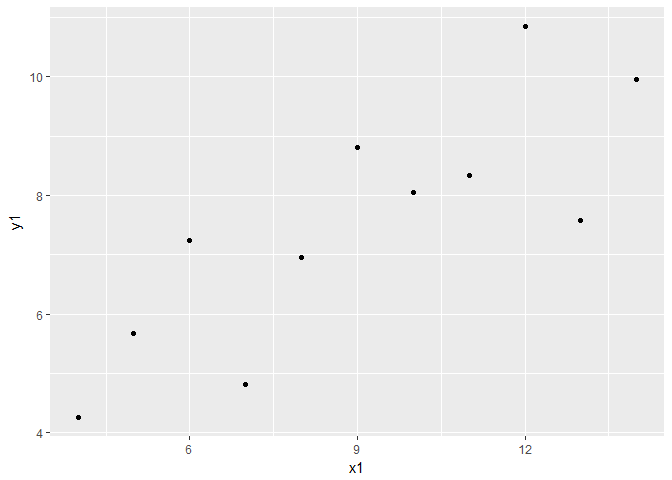
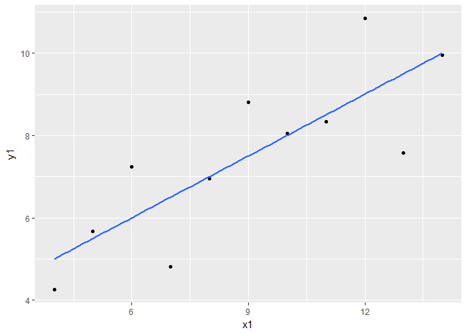
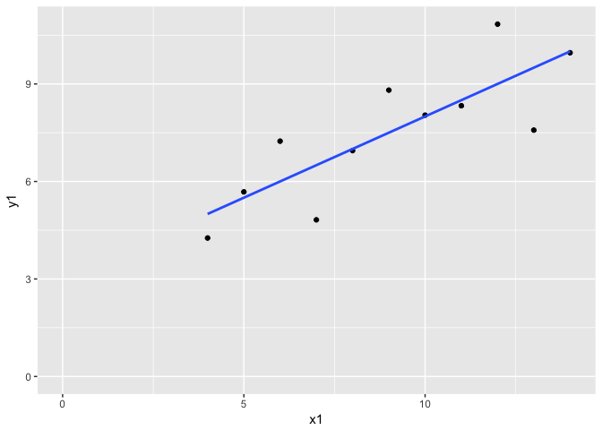
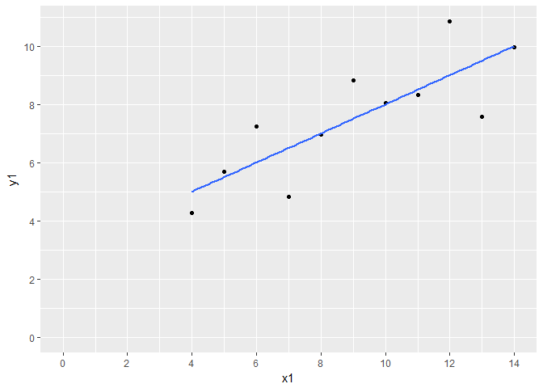
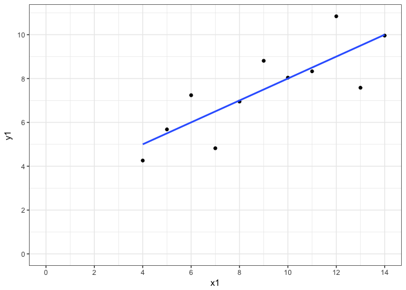
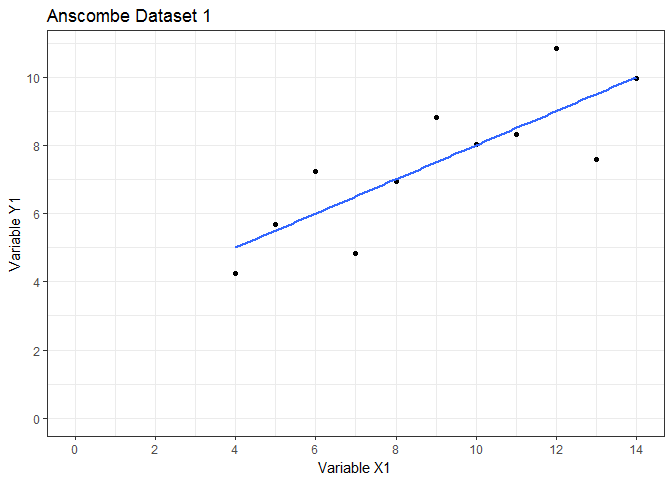
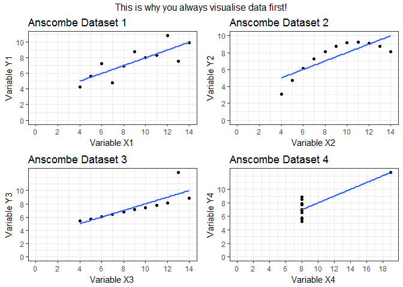
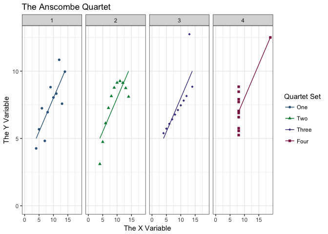

# The Anscombe Exercise
Jilly MacKay  
21 November 2017  
##About This Exercise
**Exercise Type:** Confidence Builder

*Confidence Builders are designed to get you more comfortable with R. We'll go through bits of code more or less step-by-step, and describe the reasoning behind certain actions. Remember - it's not cheating to copy code from this document and paste it into your R Studio console!*

**Exercise Suitability:** Beginner

*If you have R Studio installed on your machine and you know what an object is, you can work through this material.*

#The Anscombe Exercise
This exercise will take you through a really fun little dataset called the *Anscombe Quartet*. I've been trying to teach this exercise using data I've made up myself, and it's never quite worked. Imagine my delight when I heard that Francis Anscombe had already created the perfect dataset for me! At least, according to Wikipedia, no one knows exactly how he came up with it.

The **aim** of this exercise is to make you more comfortable with entering code in R. 

##Learning Outcomes
By the end of this workshop you should be able to . . .

* Provide descriptive statistics for data
* Run a simple regression on data
* Change arguments in a function
* Create visualisations in R


#The R Environment
Here are the packages you'll need for this exercise. (Remember, if you don't have one of these packages you can install it with the command: `install.packages("packagename")`

```r
library(ggplot2)
library(gridExtra)
library(pastecs)
library(tidyr)
library(dplyr)
```


#The Anscombe Dataset
The Anscombe dataset is really interesting and comes pre-loaded as part of the package `datasets`. This is a package which comes as standard in any R installation and so we can look at it immediately just by typing the name of the dataset into R Studio. 

R Studio will show us all rows of this dataset because it's quite small (only 11 rows). If we had a larger dataset, it would cut off after about 10 rows.


```r
anscombe 
```

```
##    x1 x2 x3 x4    y1   y2    y3    y4
## 1  10 10 10  8  8.04 9.14  7.46  6.58
## 2   8  8  8  8  6.95 8.14  6.77  5.76
## 3  13 13 13  8  7.58 8.74 12.74  7.71
## 4   9  9  9  8  8.81 8.77  7.11  8.84
## 5  11 11 11  8  8.33 9.26  7.81  8.47
## 6  14 14 14  8  9.96 8.10  8.84  7.04
## 7   6  6  6  8  7.24 6.13  6.08  5.25
## 8   4  4  4 19  4.26 3.10  5.39 12.50
## 9  12 12 12  8 10.84 9.13  8.15  5.56
## 10  7  7  7  8  4.82 7.26  6.42  7.91
## 11  5  5  5  8  5.68 4.74  5.73  6.89
```


#Running Descriptive Statistics
Let's start by exploring the means and medians of all these variables. There is a very handy command `stat.desc` from the package`pastecs` which can do this for us. 

(Note - there are LOADS of packages which give you descriptive stats. Check out [this statmethods page](https://www.statmethods.net/stats/descriptives.html) for more examples. I just personally like `pastecs`.)


```r
stat.desc(anscombe)
```

```
##                  x1     x2     x3     x4     y1     y2     y3     y4
## nbr.val      11.000 11.000 11.000 11.000 11.000 11.000 11.000 11.000
## nbr.null      0.000  0.000  0.000  0.000  0.000  0.000  0.000  0.000
## nbr.na        0.000  0.000  0.000  0.000  0.000  0.000  0.000  0.000
## min           4.000  4.000  4.000  8.000  4.260  3.100  5.390  5.250
## max          14.000 14.000 14.000 19.000 10.840  9.260 12.740 12.500
## range        10.000 10.000 10.000 11.000  6.580  6.160  7.350  7.250
## sum          99.000 99.000 99.000 99.000 82.510 82.510 82.500 82.510
## median        9.000  9.000  9.000  8.000  7.580  8.140  7.110  7.040
## mean          9.000  9.000  9.000  9.000  7.501  7.501  7.500  7.501
## SE.mean       1.000  1.000  1.000  1.000  0.613  0.613  0.612  0.612
## CI.mean.0.95  2.228  2.228  2.228  2.228  1.365  1.365  1.364  1.364
## var          11.000 11.000 11.000 11.000  4.127  4.128  4.123  4.123
## std.dev       3.317  3.317  3.317  3.317  2.032  2.032  2.030  2.031
## coef.var      0.369  0.369  0.369  0.369  0.271  0.271  0.271  0.271
```

For each variable in the array, `stat.desc` gives us:

* `nbr.val` Number of values within the variable
* `nbr.null` Number of null values
* `nbr.na` Number of missing values
* `min` Minimum value
* `max` Maximum value
* `range` Maximum-minimum value
* `sum` Sum of all non-missing values
* `median` The median value
* `mean` The mean value
* `SE.mean` The standard error of the mean
* `CI.mean.0.95` The 95% confidence intervals of this mean
* `var` The variance of this variable
* `std.dev` The standard deviation of the mean
* `coef.var` The variation coefficient (standard deviation/mean)

With these descriptive statistics, we might want to start writing our interpretation of the data. For example ...

> The average score of *x* was 9 ±3.3 standard deviations.

###Changing Arguments in a Function

You might decide you don't want to bother with *all* the elements of `stat.desc` and so you could explore how to modify the command by asking R `help("stat.desc")` which will show you the help documentation for the function. Note that it talks about *arguments*. 


```r
stat.desc(anscombe, basic=FALSE, norm=FALSE, p=0.99)
```

```
##                  x1     x2     x3     x4    y1    y2    y3    y4
## median        9.000  9.000  9.000  8.000 7.580 8.140 7.110 7.040
## mean          9.000  9.000  9.000  9.000 7.501 7.501 7.500 7.501
## SE.mean       1.000  1.000  1.000  1.000 0.613 0.613 0.612 0.612
## CI.mean.0.99  3.169  3.169  3.169  3.169 1.941 1.941 1.940 1.940
## var          11.000 11.000 11.000 11.000 4.127 4.128 4.123 4.123
## std.dev       3.317  3.317  3.317  3.317 2.032 2.032 2.030 2.031
## coef.var      0.369  0.369  0.369  0.369 0.271 0.271 0.271 0.271
```

By setting the arguments `basic=FALSE` and `norm=FALSE`, we've told R we only care about the information that the `desc` argument gives us. Note, because we only want the `desc` argument we don't need to bother typing it in. It's set to `true` by default. You'd get the same result by typing `stat.desc(anscombe, basic=FALSE, desc=TRUE, norm=FALSE, p=0.99)` which you can try yourself. We've also changed the confidence interval width to 0.99 (i.e. 99 %). 

In this example, there's no real harm in getting all the information `stat.desc` can give us, but when we start plotting the data we will want to play about with the arguments in the `ggplot` command, so that's why you're seeing them here!

#Run a Regression
We're going to run four regressions for this dataset (all four *x*s against all 4 *y*s) and explore them. This will be done using R's inbuilt stats package, so there's no need to load any specific package into our library. 


```r
regression1 <- lm (y1~x1, data=anscombe)
regression2 <- lm (y2~x2, data=anscombe)
regression3 <- lm (y3~x3, data=anscombe)
regression4 <- lm (y4~x4, data=anscombe)
summary (regression1)
```

```
## 
## Call:
## lm(formula = y1 ~ x1, data = anscombe)
## 
## Residuals:
##     Min      1Q  Median      3Q     Max 
## -1.9213 -0.4558 -0.0414  0.7094  1.8388 
## 
## Coefficients:
##             Estimate Std. Error t value Pr(>|t|)   
## (Intercept)    3.000      1.125    2.67   0.0257 * 
## x1             0.500      0.118    4.24   0.0022 **
## ---
## Signif. codes:  0 '***' 0.001 '**' 0.01 '*' 0.05 '.' 0.1 ' ' 1
## 
## Residual standard error: 1.24 on 9 degrees of freedom
## Multiple R-squared:  0.667,	Adjusted R-squared:  0.629 
## F-statistic:   18 on 1 and 9 DF,  p-value: 0.00217
```

```r
summary (regression2)
```

```
## 
## Call:
## lm(formula = y2 ~ x2, data = anscombe)
## 
## Residuals:
##    Min     1Q Median     3Q    Max 
## -1.901 -0.761  0.129  0.949  1.269 
## 
## Coefficients:
##             Estimate Std. Error t value Pr(>|t|)   
## (Intercept)    3.001      1.125    2.67   0.0258 * 
## x2             0.500      0.118    4.24   0.0022 **
## ---
## Signif. codes:  0 '***' 0.001 '**' 0.01 '*' 0.05 '.' 0.1 ' ' 1
## 
## Residual standard error: 1.24 on 9 degrees of freedom
## Multiple R-squared:  0.666,	Adjusted R-squared:  0.629 
## F-statistic:   18 on 1 and 9 DF,  p-value: 0.00218
```

```r
summary (regression3)
```

```
## 
## Call:
## lm(formula = y3 ~ x3, data = anscombe)
## 
## Residuals:
##    Min     1Q Median     3Q    Max 
## -1.159 -0.615 -0.230  0.154  3.241 
## 
## Coefficients:
##             Estimate Std. Error t value Pr(>|t|)   
## (Intercept)    3.002      1.124    2.67   0.0256 * 
## x3             0.500      0.118    4.24   0.0022 **
## ---
## Signif. codes:  0 '***' 0.001 '**' 0.01 '*' 0.05 '.' 0.1 ' ' 1
## 
## Residual standard error: 1.24 on 9 degrees of freedom
## Multiple R-squared:  0.666,	Adjusted R-squared:  0.629 
## F-statistic:   18 on 1 and 9 DF,  p-value: 0.00218
```

```r
summary (regression4)
```

```
## 
## Call:
## lm(formula = y4 ~ x4, data = anscombe)
## 
## Residuals:
##    Min     1Q Median     3Q    Max 
## -1.751 -0.831  0.000  0.809  1.839 
## 
## Coefficients:
##             Estimate Std. Error t value Pr(>|t|)   
## (Intercept)    3.002      1.124    2.67   0.0256 * 
## x4             0.500      0.118    4.24   0.0022 **
## ---
## Signif. codes:  0 '***' 0.001 '**' 0.01 '*' 0.05 '.' 0.1 ' ' 1
## 
## Residual standard error: 1.24 on 9 degrees of freedom
## Multiple R-squared:  0.667,	Adjusted R-squared:  0.63 
## F-statistic:   18 on 1 and 9 DF,  p-value: 0.00216
```

Here we might want to report these findings. 

> There was a significant, positive relationship between *x* and *y* (F^1,9^=18, p=0.002) in which *x* explained approximately 63% of the variation observed in *y*.

Now you're probably thinking "Great! Let's write up the paper and go home!"

#Visualising Data
Everything we've seen so far has shown us that we have identical relationships between *x* and *y* in the Anscombe dataset. So here's what we should have done first . . . 

We're going to use `ggplot` for this. (We're also going to lean very heavily on [Ian and Stella's great ggplot tutorial](https://ianhandel.github.io/plotting-with-r/index.html) which I recommend if you want to learn more about `ggplot`). We'll walk through building the first chart and then build the others in one go. 

##Understanding ggplot layers


```r
ggplot (data=anscombe, aes(x=x1, y=y1))
```

<!-- -->

The `ggplot` command first needs to know what *data* to use, (the `data` argument) and then what *aesthetics* ( the `aes` argument). But you will have spotted pretty quickly that there's no data in there yet! We need to start layering information into the `ggplot` command. The two most important types of layers are the geometric elements (`geoms`) and statistical transformations (`stats`). 

We'll begin by adding a layer of points with the `geom_point` function.


```r
ggplot (data=anscombe, aes(x=x1, y=y1)) +
  geom_point()
```

<!-- -->

Now we're getting somewhere! Let's add a statistical layer. 


```r
ggplot (data=anscombe, aes(x=x1, y=y1)) +
  geom_point() +
  stat_smooth (method="lm", se=FALSE)
```

<!-- -->

This looks like a proper chart! Still, your research methods teacher will probably shout at you if you don't have the x and y axis start at zero . . . 


```r
ggplot (data=anscombe, aes(x=x1, y=y1)) +
  geom_point() +
  stat_smooth(method="lm", se=FALSE) +
  expand_limits(x=0, y=0)
```

<!-- -->

And she'll also shout at you for not having the x and y axis share sensible scales 


```r
ggplot (data=anscombe, aes(x=x1, y=y1)) +
  geom_point() +
  stat_smooth(method="lm", se=FALSE) +
  expand_limits(x=0, y=0) +
  scale_x_continuous(breaks = seq(0, 20, 2)) +
  scale_y_continuous(breaks = seq(0, 10, 2))
```

<!-- -->

And why is the background grey? You know that's a waste of ink if you print it out. 


```r
ggplot(data=anscombe, aes(x=x1, y=y1)) +
  geom_point() +
  stat_smooth(method="lm", se=FALSE) +
  theme_bw() +
  expand_limits(x=0, y=0) +
  scale_x_continuous(breaks = seq(0, 20, 2)) +
  scale_y_continuous(breaks = seq(0, 10, 2))
```

<!-- -->

Maybe you need a title, and better axis labels too?


```r
ggplot(data=anscombe, aes(x=x1, y=y1)) +
  geom_point() +
  stat_smooth(method="lm", se=FALSE) +
  theme_bw() +
  expand_limits(x=0, y=0) +
  scale_x_continuous(breaks = seq(0, 20, 2)) +
  scale_y_continuous(breaks = seq(0, 10, 2)) +
  ggtitle("Anscombe Dataset 1") +
  xlab("Variable X1") +
  ylab("Variable Y1")
```

<!-- -->

##Building ggplots
Personally, I like to make my ggplots objects like so . . . 

```r
Anscombe1 <- ggplot(data=anscombe, aes(x=x1, y=y1)) +
  geom_point() +
  stat_smooth(method="lm", se=FALSE) +
  theme_bw() +
  expand_limits(x=0, y=0) +
  scale_x_continuous(breaks = seq(0, 20, 2)) +
  scale_y_continuous(breaks = seq(0, 10, 2)) +
  ggtitle("Anscombe Dataset 1") +
  xlab("Variable X1") +
  ylab("Variable Y1")
```

Then I can call them back much more easily if I want to look at them again


```r
Anscombe1
```

<!-- -->

And now I can combine these into a grid by taking the first plot `Anscombe1` and adding new column mappings e.g.  `aes(x=x2, y=y2)` and labelling e.g. `ggtitle("Anscombe Dataset 2")`. 

```r
Anscombe2 <- Anscombe1 +
  aes(x=x2, y=y2) +
  ggtitle("Anscombe Dataset 2") + xlab("Variable X2") + ylab("Variable Y2")
Anscombe3 <- Anscombe1 +
  aes(x=x3, y=y3) +
  ggtitle("Anscombe Dataset 3") + xlab("Variable X3") + ylab("Variable Y3")
Anscombe4 <- Anscombe1 +
  aes(x=x4, y=y4) +
  ggtitle("Anscombe Dataset 4") + xlab("Variable X4") + ylab("Variable Y4")

#And now let's put them all together!

grid.arrange(Anscombe1, Anscombe2, Anscombe3, Anscombe4, top="This is why you always visualise data first!")
```

<!-- -->


Lesson learned, eh?!

#Where Do We Go From Here?
If you spend enough time on it, you can create truly beautiful visualisations in `ggplot2`. Play about with this code and see what you can do with it - share your best attempts! 


I want to create a chart with all the sets overlaid, so I need all the x values in one column, all the y columns in another, and a new factor to tell me which set it belonged to. To change the shape of the data I'm going to use the `tidyr` and `dplyr` packages to do this. 


```r
LongAnscombe <- anscombe %>%
  mutate(observation=seq_len(n()))%>%
  gather(key, value, -observation)%>% 
  separate(key, c("variable", "set") , 1 , convert=TRUE)%>%
  mutate(set=factor(set))%>%
  spread(variable, value)
LongAnscombe
```

```
##    observation set  x     y
## 1            1   1 10  8.04
## 2            1   2 10  9.14
## 3            1   3 10  7.46
## 4            1   4  8  6.58
## 5            2   1  8  6.95
## 6            2   2  8  8.14
## 7            2   3  8  6.77
## 8            2   4  8  5.76
## 9            3   1 13  7.58
## 10           3   2 13  8.74
## 11           3   3 13 12.74
## 12           3   4  8  7.71
## 13           4   1  9  8.81
## 14           4   2  9  8.77
## 15           4   3  9  7.11
## 16           4   4  8  8.84
## 17           5   1 11  8.33
## 18           5   2 11  9.26
## 19           5   3 11  7.81
## 20           5   4  8  8.47
## 21           6   1 14  9.96
## 22           6   2 14  8.10
## 23           6   3 14  8.84
## 24           6   4  8  7.04
## 25           7   1  6  7.24
## 26           7   2  6  6.13
## 27           7   3  6  6.08
## 28           7   4  8  5.25
## 29           8   1  4  4.26
## 30           8   2  4  3.10
## 31           8   3  4  5.39
## 32           8   4 19 12.50
## 33           9   1 12 10.84
## 34           9   2 12  9.13
## 35           9   3 12  8.15
## 36           9   4  8  5.56
## 37          10   1  7  4.82
## 38          10   2  7  7.26
## 39          10   3  7  6.42
## 40          10   4  8  7.91
## 41          11   1  5  5.68
## 42          11   2  5  4.74
## 43          11   3  5  5.73
## 44          11   4  8  6.89
```

Now I want to plot it!

(I quite like [this colour cheatsheet](https://www.nceas.ucsb.edu/~frazier/RSpatialGuides/colorPaletteCheatsheet.pdf) for the `scale_colour_manual` function)


```r
AnscombeQuartet <- ggplot (data=LongAnscombe,
                           aes (x=x, y=y, color=set, shape=set)) +
  geom_point() +
  scale_colour_manual(name = "Quartet Set",
                      labels = c("One", "Two", "Three", "Four"),
                      values=c("steelblue4", "springgreen4", "slateblue4", "violetred4")) +
  scale_shape_manual(name = "Quartet Set",
                     labels=c("One", "Two", "Three", "Four"),
                     values=c(16, 17, 18, 15)) +
  stat_smooth(method = "lm", se = FALSE, lwd = 0.5) +
  theme_bw() +
  expand_limits (x=0, y=0) +
  ggtitle ("The Anscombe Quartet") +
  xlab ("The X Variable") +
  ylab ("The Y Variable") +
  facet_grid(. ~ set)
AnscombeQuartet
```

<!-- -->

Start messing about with this bit of `ggplot` code to produce your prettiest examples of the Anscombe Quartet. If you feel like you've spent enough time visualising them, here's what I suggest you do next...

`install.packages("datasauRus")`

And then you can do this . . .


```r
ggplot(datasaurus_dozen, aes(x=x, y=y, colour=dataset))+
  geom_point()+
  theme_void()+
  theme(legend.position = "none")+
  facet_wrap(~dataset, ncol=3)
```

<!-- -->

And check out these:

```r
stat.desc(datasaurus_dozen_wide, basic=FALSE, norm=FALSE)
```

```
##               away_x  away_y bullseye_x bullseye_y circle_x circle_y
## median        53.340  47.535     53.842     47.383   54.023   51.025
## mean          54.266  47.835     54.269     47.831   54.267   47.838
## SE.mean        1.407   2.261      1.407      2.260    1.406    2.260
## CI.mean.0.95   2.782   4.469      2.782      4.469    2.780    4.468
## var          281.227 725.750    281.207    725.533  280.898  725.227
## std.dev       16.770  26.940     16.769     26.936   16.760   26.930
## coef.var       0.309   0.563      0.309      0.563    0.309    0.563
##               dino_x  dino_y  dots_x  dots_y h_lines_x h_lines_y
## median        53.333  46.026  50.977  51.299    53.070    50.474
## mean          54.263  47.832  54.260  47.840    54.261    47.830
## SE.mean        1.407   2.260   1.407   2.260     1.407     2.261
## CI.mean.0.95   2.781   4.469   2.782   4.468     2.781     4.469
## var          281.070 725.516 281.157 725.235   281.095   725.757
## std.dev       16.765  26.935  16.768  26.930    16.766    26.940
## coef.var       0.309   0.563   0.309   0.563     0.309     0.563
##              high_lines_x high_lines_y slant_down_x slant_down_y
## median             54.169       32.499       53.135       46.401
## mean               54.269       47.835       54.268       47.836
## SE.mean             1.407        2.261        1.407        2.260
## CI.mean.0.95        2.782        4.469        2.782        4.469
## var               281.122      725.763      281.124      725.554
## std.dev            16.767       26.940       16.767       26.936
## coef.var            0.309        0.563        0.309        0.563
##              slant_up_x slant_up_y  star_x  star_y v_lines_x v_lines_y
## median           54.261     45.292  56.535  50.111    50.363    47.114
## mean             54.266     47.831  54.267  47.840    54.270    47.837
## SE.mean           1.407      2.261   1.407   2.260     1.407     2.261
## CI.mean.0.95      2.782      4.469   2.782   4.468     2.782     4.469
## var             281.194    725.689 281.198 725.240   281.232   725.639
## std.dev          16.769     26.939  16.769  26.930    16.770    26.938
## coef.var          0.309      0.563   0.309   0.563     0.309     0.563
##              wide_lines_x wide_lines_y x_shape_x x_shape_y
## median             64.550       46.279    47.136    39.876
## mean               54.267       47.832    54.260    47.840
## SE.mean             1.407        2.261     1.407     2.260
## CI.mean.0.95        2.782        4.469     2.782     4.468
## var               281.233      725.651   281.231   725.225
## std.dev            16.770       26.938    16.770    26.930
## coef.var            0.309        0.563     0.309     0.563
```

Got the message yet? ;)


