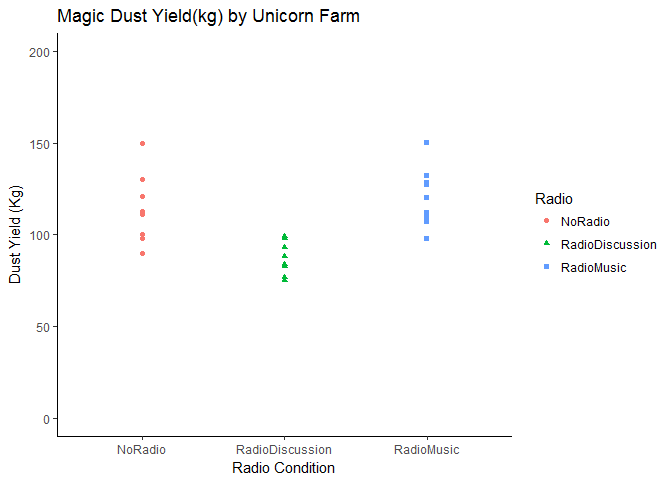
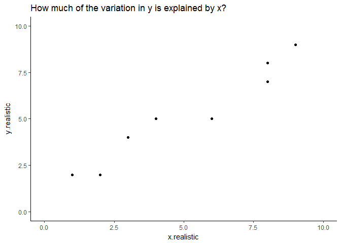
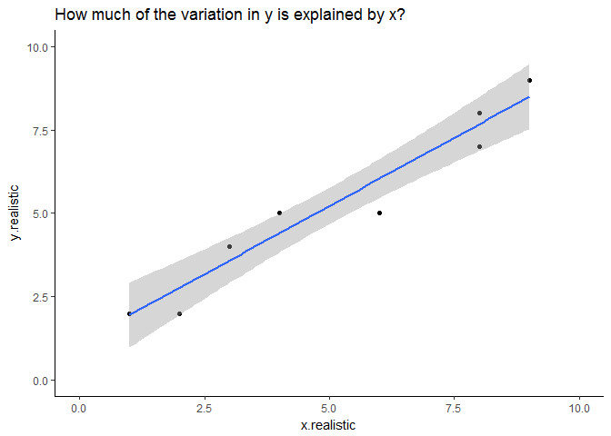
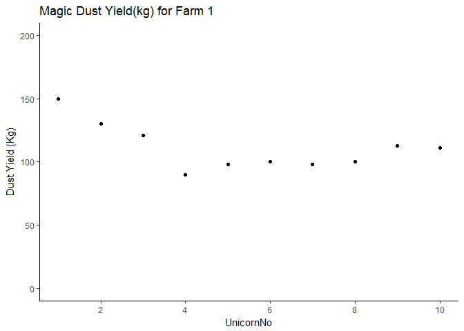
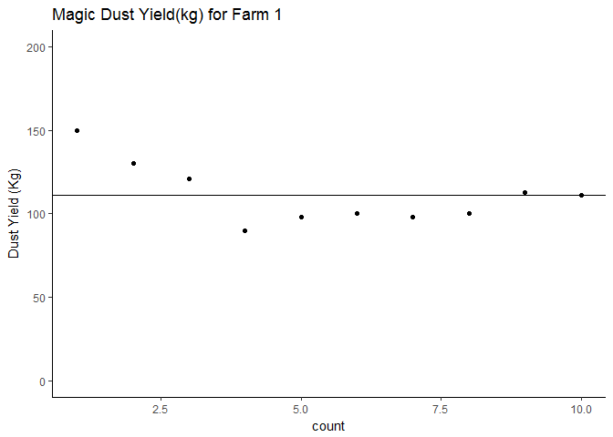
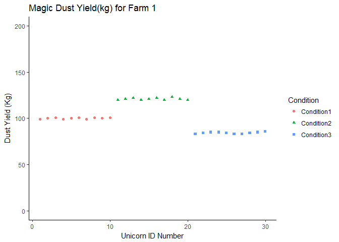
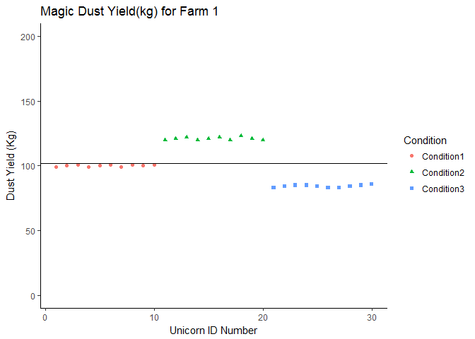
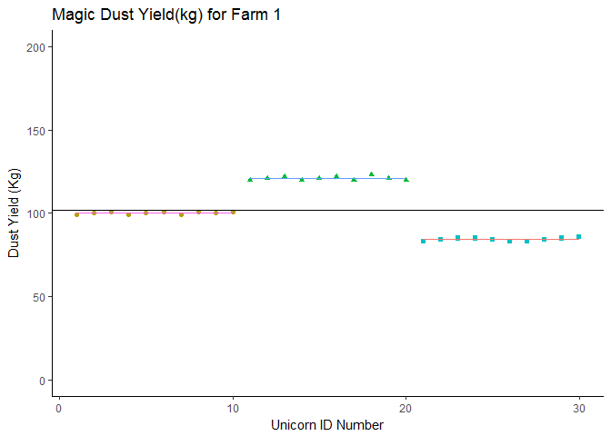
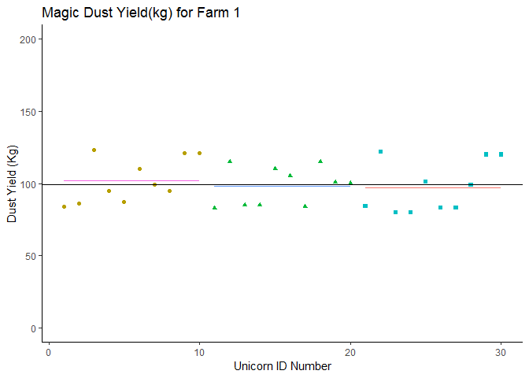

# About This Resource
**Exercise Type:** Theory
*Theory exercises teach the underpinning concepts for statistics or R that you need to know*

**Exercise Suitability:** Beginner

*If you have R Studio installed on your machine and you know what an object is, you can work through this material.*

This is an R translation of a lecture I do explaining the principles behind ANOVAs (or analyses of variances). The teaching material is very much taken from [Grafen & Hails' Modern Statistics for the Life Sciences](http://global.oup.com/uk/orc/biosciences/maths/grafen/) which I love and still reference when I'm trying to think in detail about how statistics work. 

The point of providing this as a full page is to give the R code alongside the materials. **You should feel free to copy and paste the R code directly into your console**. I think this works best if you work alongside the material. Stop to look at your data regularly with `view(data)`, and read the notes within the code chunks about how and why the code has been used. 

# Learning Outcomes

By the end of this sheet you should be able to . . . 

* Describe the principles of how an ANOVA works
* Run an ANOVA in R 
* Interpret the results of an ANOVA


# The R Environment
Here are the packages you'll need for this exercise. (Remember, if you don't have one of these packages you can install it with the command: `install.packages("packagename")` )

```r
library(tidyverse)
```

```
<<<<<<< HEAD
## -- Attaching packages ------------------------------------------------------------------------------------ tidyverse 1.2.1 --
=======
## -- Attaching packages ---------------- tidyverse 1.2.1 --
>>>>>>> 31f9bade88fdf6050bce3e24203036e13dce6049
```

```
## v ggplot2 2.2.1     v purrr   0.2.4
## v tibble  1.3.4     v dplyr   0.7.4
## v tidyr   0.7.2     v stringr 1.2.0
## v readr   1.1.1     v forcats 0.2.0
```

```
<<<<<<< HEAD
## -- Conflicts --------------------------------------------------------------------------------------- tidyverse_conflicts() --
=======
## -- Conflicts ------------------- tidyverse_conflicts() --
>>>>>>> 31f9bade88fdf6050bce3e24203036e13dce6049
## x dplyr::filter() masks stats::filter()
## x dplyr::lag()    masks stats::lag()
```

```r
library(RColorBrewer)
library (knitr)
```


# Analysis of Variance
ANOVAs fall under the GLM formula. People sometimes speak about ANOVAs as if they're a different test,  but Grafen & Hails argue they're a good introduction to the linear model formula because you have to think about variance in frequentist statistics. I'm inclinded to agree. 

## Fake Experiment
We're going to start with a fake experiment to explore this. As you may know, the national animal of Scotland is the unicorn. Scotland has started farming unicorns (n a very welfare friendly manner) to export more magic dust. Unicorns shed magic dust from their horns every morning, and this is gathered by the farmer. 

There's a belief that unicorns shed more dust when they hear music, and so we set up a trial with three farms:

* Farm 1 was our negative control farm, with no intervention.
* Farm 2 was our trial farm, where a radio station tuned to music was played over the speakers. 
* Farm 3 was a positive control farm, and played radio tuned to BBC Radio 4 for thoughtful discussion. 

We recorded the raw weekly dust yield of 10 unicorns on each farm, and the data looks like this:


```r
Radio <- tibble (NoRadio = c(150, 130, 121, 90, 98, 100, 98, 100, 113, 111),
                 RadioMusic = c(112, 127, 132, 150, 112, 128, 110, 120, 98, 107),
                 RadioDiscussion = c(75, 98, 88, 83, 83, 77, 75, 84, 93, 99))

# Remember you can view this data in R Studio with `View(Radio)`
```

We could look at the data directly, but let's ask R to make it look a little prettier:


```r
kable (Radio,
       col.names = c("No Radio", "Radio Playing Music", "Radio Playing Discussion"), 
       caption = "Raw weekly dust yield (kg) from three unicorn farms")
```


Table: Raw weekly dust yield (kg) from three unicorn farms

 No Radio   Radio Playing Music   Radio Playing Discussion
---------  --------------------  -------------------------
      150                   112                         75
      130                   127                         98
      121                   132                         88
       90                   150                         83
       98                   112                         83
      100                   128                         77
       98                   110                         75
      100                   120                         84
      113                    98                         93
      111                   107                         99

We always want to know **Does x affect y?**. 

In this case, we're asking: **Does radio as a background noise affect the magic dust yield of unicorns?**

### Tidy Data Is Important!
I wanted to write the data in that way because it's quite a logical way to think about it - *for a human*. R prefers data to be [tidy]().

Luckily we can tidy this data extremely easy. 


```r
RadioTidy <- Radio %>%
  gather(key = "Radio", value = "DustYield")

# Remember to `View(RadioMelt)` to see what this code has done!
```


## Let's Visualise The Data

Visualising data is always a good stop - but note that in this exercise I'm going to ask you to visualise the data more often than you would in practice. This is because I want to demonstrate different aspects of variance. 

Learning how to do these visualisations is just an extra benefit you get ;)


```r
ggplot (RadioTidy, aes (x = Radio, y = DustYield)) + 
     geom_point(aes(shape = Radio, colour = Radio)) +
     labs (title = "Magic Dust Yield(kg) by Unicorn Farm", 
           y = "Dust Yield (Kg)", x = "Radio Condition") +
     scale_y_continuous(limits = c(0, 200)) +
     theme_classic ()
```

<!-- -->

In this chart we have plotted the mean yield of every single unicorn by farm. We still want to know whether radio affects yield, but we know that some unicorns are probably high dust yielders, and others might be low yielding unicorns. In other words, we know that individuals vary, and so we want to know what happens to the group *on average*. 

But we can also see here that the groups seem to be different. The amount of variation isn't the same between the groups. In fact, the farm 'Radio Discussion' is more closely clustered together than the others. 


## Partitioning Variation
Let's think a little bit more about what we mean by this question: *does x affect y?*

We want to know what proportion of the variation we observe in y can be explained by x. 


```r
# Let's have some new data
examples <- tibble (x.perfect = c(1,2,3,4,5,6,7,8,9,10), 
                    y.perfect = c(1,2,3,4,5,6,7,8,9,10), 
                    x.realistic = c(1,2,3,4,4,6,8,8,9,11), 
                    y.realistic = c(2, 2, 4, 5, 5, 5, 7, 8, 9, 9))

ggplot (data = examples, aes(x.perfect, y.perfect))+
  geom_point () +
  scale_y_continuous(limits =c(0,10)) +
  scale_x_continuous(limits = c(0,10)) +
  labs (title = "100% of the variation in y is explained by x") +
  theme_classic()
```

<!-- -->

In a 'perfect' dataset, we see that for every step x increases, y increases by the same. There's a 1:1 relationship between the two. 

Of course, we very rarely ever see this in the real world. 


How does it look with (slightly) more realistic data?


```r
ggplot (data = examples, aes(x.realistic, y.realistic))+
  geom_point () +
  scale_y_continuous(limits =c(0,10)) +
  scale_x_continuous(limits = c(0,10)) +
  labs (title = "How much of the variation in y is explained by x?") +
  theme_classic()
```

```
## Warning: Removed 1 rows containing missing values (geom_point).
```

<!-- -->

Most of us looking at this chart would be able to draw a 'line of best fit' describing the relationship between x and y in this example. With a linear model we can calculate this exactly. (This is the exact same equation as you would have learned at school `y = mx + c`, or `predicted y = gradient * (a value of x) + y intercept`)

Let's ask R to fit a linear model for this data:

```r
lm(data = examples, y.realistic ~ x.realistic)
```

```
## 
## Call:
## lm(formula = y.realistic ~ x.realistic, data = examples)
## 
## Coefficients:
## (Intercept)  x.realistic  
##      1.3659       0.7561
```
The `lm` call stands for 'linear model' and is part of R's basic stats code. 

The output here starts with the *Call* which reiterates what we specificed in our `lm` command. Then it gives us:

 * Coefficient of the intercept (where our model line crosses the y axis)
 * Coefficient of x.realistic
 
Since x.realistic is a continuous variable, the x.realistic coeffcient represents the difference in the predicted value of Y for each one-unit difference in x.realistic. 

If that's confusing, let's run this on the perfect data:


```r
lm(data = examples, y.perfect ~ x.perfect)
```

```
## 
## Call:
## lm(formula = y.perfect ~ x.perfect, data = examples)
## 
## Coefficients:
## (Intercept)    x.perfect  
##   1.123e-15    1.000e+00
```
The coefficient for x.perfect is *1* - because for every 1 step increase in the value of x, our value of y increases by 1. 


But what about *significance*? Which we all know is the thing you're really looking for here. We can find that out by asking R to summarise the model:


```r
summary(lm(data = examples, y.realistic ~ x.realistic))
```

```
## 
## Call:
## lm(formula = y.realistic ~ x.realistic, data = examples)
## 
## Residuals:
##     Min      1Q  Median      3Q     Max 
## -0.9024 -0.6159  0.1220  0.6037  0.8293 
## 
## Coefficients:
##             Estimate Std. Error t value Pr(>|t|)    
## (Intercept)  1.36585    0.46584   2.932   0.0189 *  
## x.realistic  0.75610    0.07258  10.418 6.25e-06 ***
## ---
## Signif. codes:  0 '***' 0.001 '**' 0.01 '*' 0.05 '.' 0.1 ' ' 1
## 
## Residual standard error: 0.7199 on 8 degrees of freedom
## Multiple R-squared:  0.9314,	Adjusted R-squared:  0.9228 
## F-statistic: 108.5 on 1 and 8 DF,  p-value: 6.247e-06
```
This time we get more information. The coefficients are still listed in the table, alongside their standard error, a T Value and a P value (and look at how significant it is - job done, right?)

At the top we have residuals which we'll come to another day, and at the bottom we have an F statistic and a P Value (these are the ones I'd pay attention to if I were you) and an `Adjusted R-squared`. At the moment this tell us that 92% of the variation in y.realistic can be explained by x.realistic.

And if we wanted, we could add this to our plot from earlier with the addition of a single line of code:


```r
ggplot (data = examples, aes(x.realistic, y.realistic))+
  geom_point () +
  scale_y_continuous(limits =c(0,10)) +
  scale_x_continuous(limits = c(0,10)) +
  labs (title = "How much of the variation in y is explained by x?") +
  theme_classic() + # And add a single line below:
  geom_smooth (method = 'lm') 
```

```
## Warning: Removed 1 rows containing non-finite values (stat_smooth).
```

```
## Warning: Removed 1 rows containing missing values (geom_point).
```

<!-- -->

This is easy to do for two continuous variables, but in our unicorn farm example our explanatory variable is categorical. How do we decide how much of a difference in our response (dust yield) can be attributed to the radio condition?


# Calculating Variance

The variability of data is how much the data is scattered around the mean. An ANOVA is simply asking: **Is the mean of each group a better predictor than the mean of all the data?**.  

Let's start by looking at only one farm:


```r
Radio %>%
  mutate(UnicornNo = c(1,2,3,4,5,6,7,8,9,10)) %>% 
  # The mutate function adds a new variable just to plot this one specific chart
  # And then we pipe it directly into ggplot, so we're not changing the Radio data
  # Remember you can check this with `View(Radio)`, you'll see 'UnicornNo' doesn't exist.
  ggplot (aes (x = UnicornNo, y = NoRadio)) + 
  geom_point() +
  labs (title = "Magic Dust Yield(kg) for Farm 1", y = "Dust Yield (Kg)") +
  scale_y_continuous(limits = c(0, 200)) +
  scale_x_continuous(breaks = c(0, 2, 4, 6, 8, 10)) + 
  # Edit the above line out to see what happens to the x axis
  theme_classic ()
```

<!-- -->

Deviations from the mean will be both positive and negative, and the sum of these deviations will always be zero. First, let's find out the mean dust yield of the farm without any radio ...


```r
RadioTidy %>%
  group_by(Radio) %>%
  filter(Radio == "NoRadio") %>%
  summarise(mean = mean(DustYield))
```

```
## # A tibble: 1 x 2
##     Radio  mean
##     <chr> <dbl>
## 1 NoRadio 111.1
```

```r
# This looks like a super complicated way to calculate a mean - why do it like this?
# Well, first by piping the data we don't actually save any changes
# We just get to see the result we're interested in. 
# Delete the 'filter' line and see what that looks like. 
```

We could plot this on our chart:

```r
Radio %>%
  mutate(count = c(1,2,3,4,5,6,7,8,9,10)) %>%
  ggplot (aes (x = count, y = NoRadio)) + 
  geom_point() +
  labs (title = "Magic Dust Yield(kg) for Farm 1", y = "Dust Yield (Kg)") +
  scale_y_continuous(limits = c(0, 200)) +
  theme_classic () +
  # This new line basically draws a line on our chart based on the mean we just calculated
  geom_hline(yintercept = 111.1) 
```

<!-- -->


## Deviation from the group mean
We want to know what the deviation from the mean of the group is for each individual. We can ask R to calculate this for us using the handy `mutate` function:


```r
Radio %>%
  mutate (NoRadioDeviation = (mean(NoRadio) - NoRadio)) 
```

```
## # A tibble: 10 x 4
##    NoRadio RadioMusic RadioDiscussion NoRadioDeviation
##      <dbl>      <dbl>           <dbl>            <dbl>
##  1     150        112              75            -38.9
##  2     130        127              98            -18.9
##  3     121        132              88             -9.9
##  4      90        150              83             21.1
##  5      98        112              83             13.1
##  6     100        128              77             11.1
##  7      98        110              75             13.1
##  8     100        120              84             11.1
##  9     113         98              93             -1.9
## 10     111        107              99              0.1
```

```r
# I'm using Radio here instead of RadioTidy because I'm being a bit lazy
```

And if you don't believe me, you can run those calculations yourself:


```r
111.1-150
```

```
## [1] -38.9
```
See? Not convinced yet ... ?


```r
111.1-130
```

```
## [1] -18.9
```

```r
111.1-121
```

```
## [1] -9.9
```

```r
111.1-90
```

```
## [1] 21.1
```

```r
111.1-98
```

```
## [1] 13.1
```

```r
111.1 - 100
```

```
## [1] 11.1
```

```r
# And so on
```

You can check that the sum of NoRadioDeviation does add to zero (or at least very close to it given some rounding errors):

```r
Radio %>%
  mutate (NoRadioDeviation = (mean(NoRadio) - NoRadio)) %>%
  summarise ("Sum of Deviations from No Radio Mean" = sum(NoRadioDeviation))
```

```
## # A tibble: 1 x 1
##   `Sum of Deviations from No Radio Mean`
##                                    <dbl>
## 1                          -5.684342e-14
```

No matter what your dataset looks like, no matter what numbers are in there, this will always be true. 

## Calculating variance from deviations
Because the deviations will always sum to 0, the raw deviations are not very useful. 

So how can we compare the deviation (variance) between two datasets?

If we square the deviations and then sum them we have a more useful measure of variance that we call *Sums of Squares (SS)*


```r
Radio %>%
  mutate (NoRadioDeviation = (mean(NoRadio) - NoRadio),
          SquaredNoRadioDeviation = (NoRadioDeviation*NoRadioDeviation))
```

```
## # A tibble: 10 x 5
##    NoRadio RadioMusic RadioDiscussion NoRadioDeviation
##      <dbl>      <dbl>           <dbl>            <dbl>
##  1     150        112              75            -38.9
##  2     130        127              98            -18.9
##  3     121        132              88             -9.9
##  4      90        150              83             21.1
##  5      98        112              83             13.1
##  6     100        128              77             11.1
##  7      98        110              75             13.1
##  8     100        120              84             11.1
##  9     113         98              93             -1.9
## 10     111        107              99              0.1
## # ... with 1 more variables: SquaredNoRadioDeviation <dbl>
```

Sums of Squares are useful because they don't sum to 0, but they're still influenced by the number of data points we have (e.g. if we had one more unicorn in the No Radio farm the sum of squares would have to increase). 

So we calculate the variance of the dataset by:


`Variance = Sums of Squares / (n - 1)`


Variance is therefore a measure of the variability of a dataset that takes the size of the dataset into account. And we can use variance to compare variability across different datasets. It's very useful!

R, of course, has a very handy function to calculate variance automatically, `var`:


```r
Radio %>%
  summarise("Variance No Radio" = var(NoRadio))
```

```
## # A tibble: 1 x 1
##   `Variance No Radio`
##                 <dbl>
## 1               334.1
```


But if you're not convinced ...

```r
Radio %>%
  mutate (NoRadioDeviation = (mean(NoRadio) - NoRadio),
          SquaredNoRadioDeviation = (NoRadioDeviation*NoRadioDeviation)) %>%
  summarise(SumSquaresNoRadio = sum(SquaredNoRadioDeviation))
```

```
## # A tibble: 1 x 1
##   SumSquaresNoRadio
##               <dbl>
## 1            3006.9
```

And then divide that by `n-1`:

```r
3006.9/9
```

```
## [1] 334.1
```

# Partitioning Variation
Remember, in this experiment we can see that there is variation around dust yields. What we want to know is:
 
 * How much of this variation is due to our explanatory variable (what kind of radio they listened to)
 * *How does x affect y?*
 
 
## Imaginary Scenario 1
Let's imagine a scenario where the condition (our categorical variable) explains almost all of the variance in the dataset. 

It would look like this:

```r
Sce1<-tibble (Condition1 = c(99,100,101,99,100,101,99,101,100,101),
              Condition2 = c(120,121,122,120,121,122,120,123,121,120),
              Condition3 = c(83,84,85,85,84,83,83,84,85,86)) %>%
  gather (key = Condition, value = DustYield) %>%
  mutate (Count = c(1:30)) 
# In the code above I've gathered the data into a tidy format 

ImaginaryScenario1 <- Sce1 %>%
  ggplot (aes (x = Count, y = DustYield)) + 
  geom_point(aes(shape = Condition, colour = Condition)) +
  labs (title = "Magic Dust Yield(kg) for Farm 1", y = "Dust Yield (Kg)", x = "Unicorn ID Number") +
  scale_y_continuous(limits = c(0, 200)) +
  theme_classic ()

# I have also made this chart an object because we're going to update it
# It's quicker to do this as an object
# You can compare how we update this chart with how we update the ones above.

ImaginaryScenario1
```

<!-- -->


We could fit the mean of the dataset on this:


```r
ImaginaryScenario1 +
  geom_hline(yintercept = mean(Sce1$DustYield))
```

<!-- -->

Let's compare the overall mean with the group means, and see which one is the best guess for any given data point. Remember - if the condition is explaining a lot of the variation around our response, we'll see less deviation from each group mean than the overall mean. 


```r
Sce1 %>%
  group_by(Condition) %>%
  summarise(mean = mean (DustYield))
```

```
## # A tibble: 3 x 2
##    Condition  mean
##        <chr> <dbl>
## 1 Condition1 100.1
## 2 Condition2 121.0
## 3 Condition3  84.2
```

```r
ImaginaryScenario1 +
  geom_hline(yintercept = mean(Sce1$DustYield)) +
  geom_segment(aes(x =1, y = 100.1, xend =10, yend = 100.1, color = "red")) +
  geom_segment(aes(x = 11, y = 121.0, xend = 20, yend = 121.0, color = "green")) +
  geom_segment (aes(x = 21, y = 84.2, xend = 30, yend = 84.2, color = "blue")) +
  theme (legend.position = "none")
```

<!-- -->

In this case, the individual group means are a better description of the group than the overall population mean. Any statistics we were to apply would simply put a number to what we see on this chart. 


So let's look at a second scenario:

```r
Sce2<-tibble (Condition1 = c(84,86,123,95,87,110,99,95,121,121),
              Condition2 = c(83,115,85,85, 110,105,84,115,101,100),
              Condition3 = c(84,122,80,80,101,83,83,99, 120,120)) %>%
  gather (key = Condition, value = DustYield) %>%
  mutate (Count = c(1:30)) 

Sce2 %>%
  group_by(Condition) %>%
  summarise(mean = mean (DustYield))
```

```
## # A tibble: 3 x 2
##    Condition  mean
##        <chr> <dbl>
## 1 Condition1 102.1
## 2 Condition2  98.3
## 3 Condition3  97.2
```

Now we chart it, and add our segment lines for each group's mean:


```r
Sce2 %>%
  ggplot (aes (x = Count, y = DustYield)) + 
  geom_point(aes(shape = Condition, colour = Condition)) +
  labs (title = "Magic Dust Yield(kg) for Farm 1", y = "Dust Yield (Kg)", x = "Unicorn ID Number") +
  scale_y_continuous(limits = c(0, 200)) +
  theme_classic () +
  geom_hline(yintercept = mean(Sce2$DustYield)) +
  geom_segment(aes(x =1, y = 102.1, xend =10, yend = 102.1, color = "red")) +
  geom_segment(aes(x = 11, y = 98.3, xend = 20, yend = 98.3, color = "green")) +
  geom_segment (aes(x = 21, y = 97.2, xend = 30, yend = 97.2, color = "blue")) +
  theme (legend.position = "none")
```

<!-- -->

In this second scenaro, the population mean is not very different from the means of each of the three conditions. In fact, it's hard to see some of those means on the chart! We haven't successfully partitioned off any of the dataset's varaiance by looking at each of the condition means. 

In this second scenario, the explanatory variable is not explaining very much of the response variable at all. 

# Our Scenario
If we plot our unicorn data in the same format:


```r
kable (Radio,
       col.names = c("No Radio", "Radio Playing Music", "Radio Playing Discussion"), 
       caption = "Raw weekly dust yield (kg) from three unicorn farms")
```


Table: Raw weekly dust yield (kg) from three unicorn farms

 No Radio   Radio Playing Music   Radio Playing Discussion
---------  --------------------  -------------------------
      150                   112                         75
      130                   127                         98
      121                   132                         88
       90                   150                         83
       98                   112                         83
      100                   128                         77
       98                   110                         75
      100                   120                         84
      113                    98                         93
      111                   107                         99

```r
RadioTidy %>%
  mutate(count = c(1:30)) %>%
  ggplot (aes (x = count, y = DustYield)) + 
  geom_point(aes(shape = Radio, colour = Radio)) +
  labs (title = "Magic Dust Yield(kg)", y = "Dust Yield (Kg)", x = "Unicorn ID Number") +
  scale_y_continuous(limits = c(0, 200)) +
  theme_classic ()
```

<!-- -->

### A word on significance
We're beginning to get closer to the real definition of significance. 

**Significance:** Is the variability explained by our model greater than we would expect by chance alone. 

And this is what variance can answer. 

## Going Back to Sums of Squares
In our two imaginary scenarios above we were (roughly) partitioning variances by drawing lines on our charts - much like we could draw a line of best fit on the perfect data chart earlier. 

When we run a model, we want to describe that chart mathematically. 

When we calculated variance earlier, we calculated the variance in the condition mean mean (e.g. the variance for No Radio data). We can call this the **Error Sum of Squares (SSE)** which is the sum of the squares of the deviations of the data around the means of each group. 

We could also calculate ...

* **Total Sums of Squares (SSY)**, the sums of squares of the deviations of the data around the population mean. 
* **Condition Sums of Squares (SSF)**, the sums of squares of the deviations of each condition mean from the population mean. 

But why would we use any sums of squares when we already establishd that variance was a better measure?


Let's rearrange our data so we have for each 'row' the condition mean and total mean. We're going to call this dataset `MFY` for short because:

* M is the global mean
* F is the condition mean
* Y is the 'response variable'


```r
MFY <- RadioTidy %>%
  mutate ("Y" = DustYield) %>%
  mutate ("M" = mean(Y)) %>%
  # If we now ask R to group the data, it will calculate the mean per group:
  group_by(Radio) %>%
  mutate ("F" = mean(Y)) %>%
  # Remember to ungroup after!
  ungroup() 

#  I suggest you `view(MFY)`
```

We can also calculate:

* MY (The data - Dataset mean)
* MF (The condition mean - dataset mean)
* FY (The data - condition mean)


```r
MFY <- MFY %>%
 mutate (MY = (Y-M),
         MF = (F-M),
         FY = (Y - F))
```

We've calculated a lot of deviations here - but we said we always wanted to square those deviations, so:


```r
MFY <- MFY %>%
  mutate (MY2 = (MY*MY),
          MF2 = (MF*MF),
          FY2 = (FY*FY))
```

MY2, MF2 & FY2 are the squares of the deviations, but we need a sum of squares for each one. 


```r
MFY %>%
  summarise(SumSquareMY = sum(MY2),
            SumSquareMF = sum(MF2),
            SumSquareFY = sum(FY2))
```

```
## # A tibble: 1 x 3
##   SumSquareMY SumSquareMF SumSquareFY
##         <dbl>       <dbl>       <dbl>
## 1     12053.2      6301.4      5751.8
```

But we also have one more bit of information we need to consider - what we call **degrees of freedom**. Let's say we want to put those sum squares into a nice table. We could also add in a row talking about the degrees of freedom. 

There are degrees of freedom for:

* **M** - which is 1. There is only 1 bit of information in the whole group mean
* **F** - which is 3. There are only 3 means in the conditions. 
* **Y** - which is 30. We have 30 data points to observe. 

If you were to calculate the degrees of freedom (dof) for MY, MF and FY - you can run the same calculation:

* **MY** (Ydof - Mdof = 30 - 1 = 29)
* **MF** (Fdof - Mdof = 3 - 1 = 2)
* **FY** (Ydof - Fdof = 30 - 3 = 27)


We can calculate something called **mean squares** which is:
`Mean Squares = Sum of Squares / Degrees of Freedom`

So:

* **MS-MY** = (12053.2/ 29) = 415.6276
* **MS-MF**  = (6301.4/2) =  3150.7
* **MS-FY**  = (5751.8/27) =  213.0296

And this is pretty much all we can do with the data. 


```r
kable(MFY %>%
        summarise(SumSquareMY = sum(MY2),
                  SumSquareMF = sum(MF2),
                  SumSquareFY = sum(FY2),
                  MeanSquareMY = sum(MY2)/29,
                  MeanSquareMF = sum(MF2)/2,
                  MeanSquareFY = sum(FY2)/27))
```


 SumSquareMY   SumSquareMF   SumSquareFY   MeanSquareMY   MeanSquareMF   MeanSquareFY
------------  ------------  ------------  -------------  -------------  -------------
     12053.2        6301.4        5751.8       415.6276         3150.7       213.0296

Earlier we said variance was important because it took into account the size of the dataset. 

Mean Squares are very similar to the variance calculation, because they're a measure of deviation in relation to the size of the dataset. 

# The Importance of Mean Squares
If the condition (radio) has no effect on the data, then the variation we would see between the farms would be similar to the variation we saw within any given farm. It would be like Scenario 2, where the mean of the farm was no more use to us than the mean of the overall population. 

If that were the case: the `Condition Mean Square (FMS)  / Error Mean Square (EMS) = 1`

Let's look again at that last table.

```r
kable(MFY %>%
        summarise(SumSquareMY = sum(MY2),
                  SumSquareMF = sum(MF2),
                  SumSquareFY = sum(FY2),
                  MeanSquareMY = sum(MY2)/29,
                  MeanSquareMF = sum(MF2)/2,
                  MeanSquareFY = sum(FY2)/27))
```


 SumSquareMY   SumSquareMF   SumSquareFY   MeanSquareMY   MeanSquareMF   MeanSquareFY
------------  ------------  ------------  -------------  -------------  -------------
     12053.2        6301.4        5751.8       415.6276         3150.7       213.0296

And now we will take the Condition Mean Square and Error Mean Squares from that table:

* FMS = 3150.7
* ENS = 213.0296

And we'll call this the F Ratio. 


```r
3150.7/213.0296
```

```
## [1] 14.78996
```

# F Ratios and F Distributions
Because the mean squares are standardised by the size of the dataset, we can mathematically calculate the range and likelihood of any F-Ratio. This is called the F Distribution. 

You can [look up](http://www.socr.ucla.edu/Applets.dir/F_Table.html) F distributions for an alpha level of 0.05. [Click here to go directly there](http://www.socr.ucla.edu/Applets.dir/F_Table.html#FTable0.05). We are interested in the ratio between 2 and 27 degrees of freedom, which gives us a critical F ratio of **3.3541**, which our F Ratio (14.79) is much bigger than. 

In fact, if we were to plot a curve of the F Distribution between 2 and 27 degrees of freedom, less than 0.001% of the total area would be more than 14.79.

# In Conclusion . . .
> The probability of getting an F-Ratio as large as 14.8 (or larger), if the null hypothes (x has no effect on y) is true, is less than 0.001

> Or: F (between 2 and 27 degrees of freedom) = 14.79, and P < 0.001

> **CONGRATULATIONS!**

> You just ran an ANOVA completely by hand. 

# Prove It
Of course, we don't run ANOVAs by hand. We don't use all these steps to run an ANOVA. Instead we go back to the RadioTidy data, which if you `View(RadioTidy)`, you will note doesn't have any of our squares or sum squares or mean squares calculated.

And we ask R to run an ANOVA:


```r
ANOVA <- aov(DustYield ~ Radio, data = RadioTidy)
summary(ANOVA)
```

```
##             Df Sum Sq Mean Sq F value  Pr(>F)    
## Radio        2   6301    3151   14.79 4.6e-05 ***
## Residuals   27   5752     213                    
## ---
## Signif. codes:  0 '***' 0.001 '**' 0.01 '*' 0.05 '.' 0.1 ' ' 1
```

And that command `summary(ANOVA)` gives us a table exactly like the one we calculated by ourselves.

When we say that radio has a significant effect on the dust yield of unicorns in an ANOVA (F^2,27^=14.79, P<0.001) - you now know exactly what those numbers refer to. 

And now that you've run it by yourself, what would you recommend to the unicorn farmers of Scotland?
